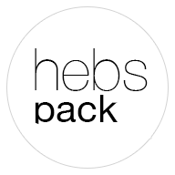

<p align="center">
    
</p>
Hebspack is a gulp configuration to bundle skin files for web development and distribution. 

## Installation

Hebspack is meant to be used on a folder containing skins. Hebspack only bundles skins that have configured 'hebspack-config.json' in root directory.

#### Installation steps:

Assuming you have [Node](https://nodejs.org/en/) version 11 or later installed. 

- First you need Navigate through terminal to a folder containing skin or skins and run this command to create 'package.json' file with default settings:

```bash
npm init
```

- Then run this command to download and install hebspack package
```bash
npm install hebspack
```

- *Optionaly*
Change default skins folder by adding hebspackconfig field in in 'package.json' file. Example:
```json
{
  "name": "skins",
  "version": "1.0.0",
  //...
  "hebspackconfig":{
    "skinsath": "/Users/admin/sites/cms/public/skins/"
  }
}
```

#### Migrating from Code Kit:

- Generate default 'hebspack-config.json' and run initial build in a specified skin by running.
```bash
npm run hebspack default init skin-name
```

- Insert the following line in head tag inside a skin's root .tpl file instead of existing asset links. Manifest path is relative to skin root directory, for example "dist/desktop/assets.manifest.json". The argument paths_to_replace is meant to replace relative paths inside css with absolute paths and needs to be sent a portion relative to skin root directory.
```php
{asset_loader position="head" paths_to_replace=['fonts/' => 'dist/desktop/fonts/', 'images/' => 'dist/desktop/images/'] manifest="dist/desktop/assets.manifest.json"}
```

- Insert the following line in body tag inside a skin's root .tpl file instead of existing asset links. Manifest path is relative to skin root directory, for example "dist/desktop/assets.manifest.json"
```php
{asset_loader position="body" manifest="dist/desktop/assets.manifest.json"}
```

- Copy @codekit-prepend file names which are written in main "scripts.js" or similiar entry point. Paste these file names in hebspack-config.json replacing libFiles array elements to ensure the order of script loading is correct. 

- Copy @codekit-prepend file names which are written in main "scripts.js" or similiar entry point. Paste these file names in hebspack-config.json replacing scriptsFiles array elements to ensure the order of script loading is correct. 

## Bundler commands

```bash
npm run hebspack [env] [init] [watch] [skin-name]
```

#### [env]

| [env]        | Description           |
| ------------- |:-------------:| 
| default     | Run bundler with default environment settings | 
| development    | Run bundler with development environment settings     |   
| production | Run bundler with production environment settings      | 
|      | The bundler is run in default environment settings without specifying an option| 

#### [init]

| [init]        | Description           |
| ------------- |:-------------:| 
| init     | Runs initial bundling | 
|      | By default bundler is run in watch mode | 

#### [watch]

| [watch]        | Description           |
| ------------- |:-------------:| 
| watch     | Runs bundler in watch mode | 
|      | By default bundler is run in watch mode | 


#### [skin-name]

| [skin-name]        | Description           |
| ------------- |:-------------:| 
| skin-name     | Runs bundling for specified skin only | 
|      | By default bundling runs for every found skin | 

## Usage examples

```bash
npm run hebspack
```
This will apply watch mode for any skin containing configured 'hebspack-config.json'. Meaning the files will only bundle on change. 

```bash
npm run hebspack init
```
This will run initial build, bundling all files for any skin containing 'hebspack-config.json'.

```bash
npm run hebspack init skin-name
```
This will run initial build, generating default 'hebspack-config.json' and bundling all files for only one skin in specified folder.

```bash
npm run hebspack watch skin-name
```
This will apply watch mode for specified skin, generating default 'hebspack-config.json.

## Custom Task Declaration

Custom task creation steps:

- Create a folder called 'gulp-tasks' inside a skin folder.

- Create 'task-name.js' changing the name to suit your task.

- Modify 'hebspack-config.json' by adding 'task-name' to tasks.init or tasks.watch array according to environmnet.

- Declare a task in 'task-name.js' choosing one of the following methods:

#### Callback

You can provide a callback parameter to your task’s function and then call it when the task is complete:
```js
const del = require('del');

module.exports = function(done) {
    del(['.build/'], done);
});
```

#### Return a Stream

You can also return a stream, usually made via gulp.src or even by using the vinyl-source-stream package directly. This will likely be the most common way of doing things.
```js
const del = require('del');

module.exports = function() {
    return gulp.src('client/**/*.js')
        .pipe(minify())
        .pipe(gulp.dest('build'));
});
```

#### Return a Promise

Return a promise and Gulp will know when it’s finished:
```js
const promisedDel = require('promised-del');

module.exports = function() {
    return promisedDel(['.build/']);
});
```

#### Return a Child Process

You can spawn child processes and just return them as well!
 ```js
const spawn = require('child_process').spawn;

module.exports = function() {
    return spawn('rm', ['-rf', path.join(__dirname, 'build')]);
});
```

#### Return a RxJS observable

It's also possible to return an RxJS observable.
 ```js
const Observable = require('rx').Observable;

module.exports = function() {
    return Observable.return(42);
});
```

## Default config explanation

```js
{
    /*Source and destination folder/files names*/
    "paths": {
        /*Source folder and file names*/
        "src": {
            /*Folder containing project assets*/
            "sourceFolder": "assets",
            /*Folder containing project styles*/
            "styleFolder": "styles",
            /*Main style files to be bundled separately*/
            "styleFiles": [
                "promotiles.scss",
                "styles.scss",
                "test.scss",
                "initial/styles.scss"
            ],
            /*Folder containing project scripts*/
            "scriptsFolder": "scripts",
            /*Specifies order for Javascript library files*/
            "libFiles": [
                "_jquery.js",
                "_jquery.ui.js",
                "_cookie.js",
                "_json.js",
                "_what-input.min.js",
                "_validation.js",
                "_validation-en.js",
                "_hebs.bp.js",
                "_swiper.js",
                "_galleria.js",
                "_variables.js",
                "_polyfills.js",
                "_ada.js"
            ],
            /*Javascript library folder*/
            "libFolder": "libraries",
            /*Main Javascript files*/
            "scriptsEntry": "scripts.js",
            /*Specifies order for Javascript files*/
            "scriptsFiles": [
                "_common.js",
                "_booking.js",
                "_photos.js",
                "_promotiles.js",
                "_events.js",
                "_reviews.js",
                "_google-maps.js",
                "_maps.js",
                "_poi.js",
                "_galleries.js",
                "_pressroom.js",
                "_rooms.js",
                "_feeds.js",
                "_calendar.js"
            ],
            /*Ignores all Javascript files with specified suffix*/
            "ignoreSuffix": "scripts.min.js",
            /*Folder containing project images*/
            "imagesFolder": "images",
            /*Folder containing project fonts*/
            "fontsFolder": "fonts",
            /*Folder containing project plugins*/
            "pluginsFolder": "plugins"
        },
        /*Destination folder and file names*/
        "dist": {
            /*Destination folder for bundling*/
            "outputFolder": "dist",
            /*Destination style folder*/
            "styleFolder": "styles",
            /*Destination scripts folder*/
            "scriptsFolder": "scripts",
            /*Name for a single Javascript file output*/
            "outputScript": "scripts.min.js",
            /*Destination images folder*/
            "imagesFolder": "images",
            /*Destination fonts folder*/
            "fontsFolder": "fonts"
        }
    },
    /*Specifies tasks and plugins to run*/
    "run": {
        /*Settings for default environment*/
        "default": {
            /*List of tasks that are run*/
            "tasks": {
                "init": ["style-init", "script-init", "image-init", "font-init", "php-plugins-init"],
                "watch": ["style-watch", "script-watch", "image-watch", "font-watch", "php-plugins-watch"]
            },
            /*Script plugins*/
            "script": {
                "sourcemaps": false,
                "uglify": false,
                "stripDebug": false
            },
            /*Style plugins*/
            "style": {
                "sourcemaps": false,
                "autoprefixer": false,
                "extractMedia": false,
                "cleanCSS": false
            }
        },
        /*Settings for development environment*/
        "development": {
            /*List of tasks that are run*/
            "tasks": {
                "init": ["style-init", "script-init", "image-init", "font-init", "php-plugins-init"],
                "watch": ["style-watch", "script-watch", "image-watch", "font-watch", "php-plugins-watch"]
            },
            /*Script plugins*/
            "script": {
                "sourcemaps": false,
                "uglify": false,
                "stripDebug": false
            },
            /*Style plugins*/
            "style": {
                "sourcemaps": false,
                "extractMedia": true,
                "cleanCSS": false,
                "autoprefixer": false
            }
        },
        /*Settings for production environment*/
        "production": {
            /*List of tasks that are run*/
            "tasks": {
                "init": ["style-init", "script-init", "image-init", "font-init", "php-plugins-init"],
                "watch": ["style-watch", "script-watch", "image-watch", "font-watch", "php-plugins-watch"]
            },
            /*Script plugins*/
            "script": {
                "sourcemaps": true,
                "uglify": true,
                "stripDebug": true
            },
            /*Style plugins*/
            "style": {
                "sourcemaps": true,
                "extractMedia": false,
                "cleanCSS": true,
                "autoprefixer": true
            }
        }
    },
    /*Plugins options*/
    "options": {
        /*Settings for default environment*/
        "default": {
            /*Script plugins options*/
            "script": {
                /*Allowed extensions*/
                "extensions": [".js"],
                "uglify": {
                    "mangle": false,
                    "compress": false
                }
            },
            /*Style plugins options*/
            "style": {
                /*Allowed extensions*/
                "extensions": [".scss"],
                "cleanCSS": {
                    "sourcemaps": true,
                    "level": {
                        "1": {
                            "removeQuotes": false
                        },
                        "2": {

                        }
                    },
                    "compatibility": {
                        "properties": {
                            "urlQuotes": true
                        }
                    }
                },
                "autoprefixer": {
                    "browsers": [
                        "last 2 versions"
                    ],
                    "cascade": false
                }
            },
            "php_plugin": {
                /*Allowed extensions*/
                "extensions": [".php"]
            },
            "image": {
                /*Allowed extensions*/
                "extensions": [".gif", ".png", ".jpg", ".jpeg", ".ai", ".svg", ".psd"]
            },
            "fonts": {
                /*Allowed extensions*/
                "extensions": [".woff", ".woff2", ".ttf", ".eot", ".svg"]
            }
        },
        /*Settings for development environment*/
        "development": {
            /*Script plugins options*/
            "script": {
                "extensions": [".js"],
                "uglify": {
                    "mangle": false,
                    "compress": false
                }
            },
            /*Style plugins options*/
            "style": {
                "extensions": [".scss"],
                "cleanCSS": {
                    "sourcemaps": true,
                    "level": {
                        "1": {
                            "removeQuotes": false
                        },
                        "2": {}
                    },
                    "compatibility": {
                        "properties": {
                            "urlQuotes": true
                        }
                    }
                },
                "autoprefixer": {
                    "browsers": [
                        "last 2 versions"
                    ],
                    "cascade": false
                }
            },
            "image": {
                /*Allowed extensions*/
                "extensions": [".gif", ".png", ".jpg", ".jpeg", ".ai", ".svg", ".psd"]
            },
            "font": {
                /*Allowed extensions*/
                "extensions": [".woff", ".woff2", ".ttf", ".eot", ".svg"]
            },
            "php_plugin": {
                /*Allowed extensions*/
                "extensions": [".php"]
            }
        },
        /*Settings for production environment*/
        "production": {
            /*Script plugins options*/
            "script": {
                "extensions": [".js"],
                "uglify": {
                    "mangle": false,
                    "compress": false
                }
            },
            /*Style plugins options*/
            "style": {
                /*Allowed extensions*/
                "extensions": [".scss"],
                "cleanCSS": {
                    "sourcemaps": true,
                    "level": {
                        "1": {
                            "removeQuotes": false
                        }
                    },
                    "compatibility": {
                        "properties": {
                            "urlQuotes": true
                        }
                    }
                },
                "autoprefixer": {
                    "browsers": [
                        "last 2 versions"
                    ],
                    "cascade": false
                }
            },
            "image": {
                /*Allowed extensions*/
                "extensions": [".gif", ".png", ".jpg", ".jpeg", ".ai", ".svg", ".psd"]
            },
            "font": {
                /*Allowed extensions*/
                "extensions": [".woff", ".woff2", ".ttf", ".eot", ".svg"]
            },
            "php_plugin": {
                /*Allowed extensions*/
                "extensions": [".php"]
            }
        }
    }
}
```

